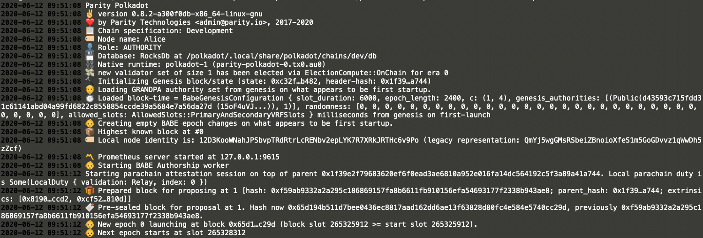
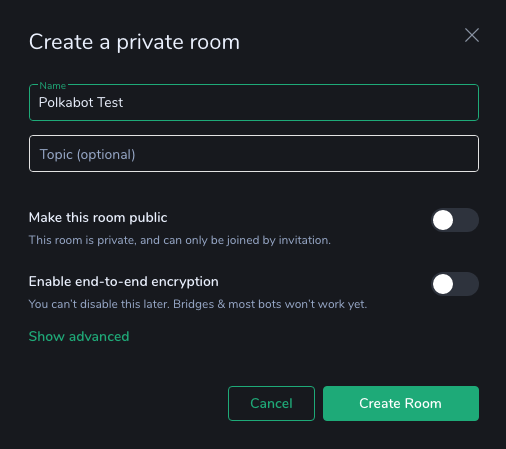
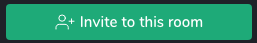
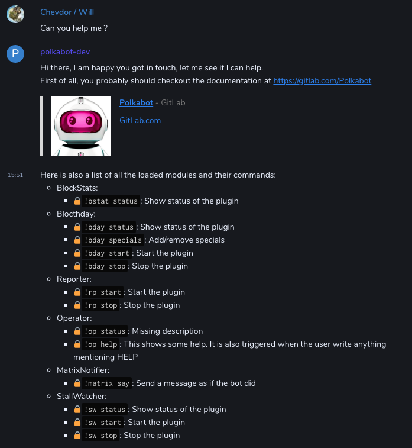
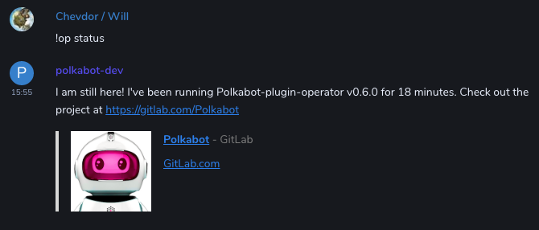

= Quickstart
:toc: right

This chapter shows how to setup, start and play with Polkabot.
This run-though is based on `Polkadot 0.8.2-a300f0db-x86_64-linux-gnu` ran using the docker image `chevdor/polkadot:0.8.2`. It is based on PolkadotJS UI v0.45.0-beta.21. It is also based on Polkabot `v0.7.0`. 

== Start a local node

Using a local node for testing makes it easier. We will be using docker:

    docker run --rm -it --name polkadev -p 9944:9944 chevdor/polkadot:0.8.2 polkadot --dev --alice --rpc-cors all --unsafe-ws-external

You should not see something like:

== Start the PolkadotJS UI

Having the PolkadotJS UI run will be convenient. Head to https://polkadot.js.org/apps/#/settings and select `Local Node`.

The UI connects and you see activity when opening https://polkadot.js.org/apps/#/explorer

== Start Polkabot

NOTE: the following will not fully work yet but let's move step by step.

    docker run --name polkabot --rm -it chevdor/polkabot

The outcome will likely not be amazing since we did not provide any configuration yet. This is confirmed by the logs we can see:

----
yarn run v1.22.4
$ cd packages/polkabot && yarn start
$ node -r ts-node/register ./src/polkabot.ts
[POLKABOT]      info    @polkabot/polkabot v0.6.0
[POLKABOT]      info    Using PolkadotJS API v1.18.1
[POLKABOT]      error   Config is NOT valid
[POLKABOT]      error   POLKABOT:
[POLKABOT]      error     📦 POLKADOT:
[POLKABOT]      error        ✅ NODE_NAME: Node
[POLKABOT]      error        ❌ URL: undefined
[POLKABOT]      error     📦 MATRIX:
[POLKABOT]      error        ✅ BOTMASTER_ID: @chevdor:matrix.org
[POLKABOT]      error        ❌ ROOM_ID: undefined
[POLKABOT]      error        ❌ BOTUSER_ID: undefined
[POLKABOT]      error        ❌ TOKEN: empty
[POLKABOT]      error        ✅ BASE_URL: https://matrix.org
[POLKABOT]      error        ✅ LOGIN_USER_ID: undefined
[POLKABOT]      error        ✅ LOGIN_USER_PASSWORD: empty
[POLKABOT]      error        ✅ MESSAGES_TO_SHOW: 3
[POLKABOT]      error     📦 BLOCTHDAY:
[POLKABOT]      error        ✅ DISABLED: true
[POLKABOT]      error        ✅ NB_BLOCKS: NaN
[POLKABOT]      error        ✅ CHANNELS: matrix,twitter
[POLKABOT]      error        ✅ SPECIALS: 42,69,8888888
[POLKABOT]      error     📦 BLOCKSTATS:
[POLKABOT]      error        ✅ DISABLED: true
[POLKABOT]      error        ✅ NB_BLOCKS: 100
[POLKABOT]      error        ✅ THRESHOLD: 8
[POLKABOT]      error        ✅ LOG_NTH_BLOCK: 1000
[POLKABOT]      error        ✅ CHANNELS: matrix,twitter
[POLKABOT]      error     📦 STALLWATCHER:
[POLKABOT]      error        ✅ DISABLED: true
[POLKABOT]      error        ✅ DURATION: 15.2
[POLKABOT]      error        ✅ CHANNELS: matrix,twitter
[POLKABOT]      error     📦 OPERATOR:
[POLKABOT]      error        ✅ DISABLED: true
[POLKABOT]      error     📦 REPORTER:
[POLKABOT]      error        ✅ DISABLED: true
[POLKABOT]      error        ✅ CHANNELS: matrix,twitter
[POLKABOT]      error        ✅ OBSERVED: [object Object]
[POLKABOT]      error        ✅ BLOCK_VIEWER: https://polkadot.js.org/apps/#/explorer/query/
[POLKABOT]      error     📦 NOTIFIER_MATRIX:
[POLKABOT]      error        ✅ DISABLED: true
[POLKABOT]      error     📦 NOTIFIER_DEMO:
[POLKABOT]      error        ✅ DISABLED: true
[POLKABOT]      error     📦 NOTIFIER_TWITTER:
[POLKABOT]      error        ✅ DISABLED: true
[POLKABOT]      error        ✅ COOLDOWN: 5000
[POLKABOT]      error        ✅ RATE_WINDOW: 10800000
[POLKABOT]      error        ✅ RATE_LIMIT: 200
[POLKABOT]      error        ❌ CONSUMER_KEY: undefined
[POLKABOT]      error        ❌ CONSUMER_SECRET: empty
[POLKABOT]      error        ❌ TOKEN_KEY: undefined
[POLKABOT]      error        ❌ TOKEN_SECRET: empty
error Command failed with exit code 1.
info Visit https://yarnpkg.com/en/docs/cli/run for documentation about this command.
error Command failed with exit code 1.
info Visit https://yarnpkg.com/en/docs/cli/run for documentation about this command.
----

Polkabot shows us a summary of the configuration it is aware of and some parts are missing. We can see however that many variables already have a default value.

Create a file called `.env.testing` with the following content (replace the `<...>`parts with proper data): 

----
## POLKADOT
POLKABOT_POLKADOT_NODE_NAME=LOCAL
POLKABOT_POLKADOT_URL=ws://polkadev:9944

## MATRIX
POLKABOT_MATRIX_BOTMASTER_ID=@<...>:matrix.org
POLKABOT_MATRIX_ROOM_ID=!<...>:matrix.org
POLKABOT_MATRIX_BOTUSER_ID=@<...>:,atrix.org
POLKABOT_MATRIX_TOKEN=<...>

# ======= PLUGINS CONFIG=============

## BLOCTHDAY
POLKABOT_BLOCTHDAY_DISABLED=false
POLKABOT_BLOCTHDAY_NB_BLOCKS=0

## BLOCKSTAT
POLKABOT_BLOCKSTATS_DISABLED=false
POLKABOT_BLOCKSTATS_NB_BLOCKS=50
POLKABOT_BLOCKSTATS_THRESHOLD=8.5
POLKABOT_BLOCKSTATS_LOG_NTH_BLOCK=100

## STALLWATCHER
POLKABOT_STALLWATCHER_DISABLED=false
POLKABOT_STALLWATCHER_DURATION=15.2

## OPERATOR
POLKABOT_OPERATOR_DISABLED=false

## REPORTER
POLKABOT_REPORTER_DISABLED=false

## NOTIFIER_MATRIX
POLKABOT_NOTIFIER_MATRIX_DISABLED=false

## NOTIFIER_TWITTER
POLKABOT_NOTIFIER_TWITTER_DISABLED=true
POLKABOT_NOTIFIER_TWITTER_CONSUMER_KEY=<...>
POLKABOT_NOTIFIER_TWITTER_CONSUMER_SECRET=<...>
POLKABOT_NOTIFIER_TWITTER_TOKEN_KEY=<...>
POLKABOT_NOTIFIER_TWITTER_TOKEN_SECRET=<...>
----

Now start Polkabot again using this new config:

    docker run --name polkabot --link polkadev --rm -it --env-file .env.testing chevdor/polkabot

The output should already look much better:

----
yarn run v1.22.4
$ cd packages/polkabot && yarn start
$ node -r ts-node/register ./src/polkabot.ts
[POLKABOT]      info    @polkabot/polkabot v0.6.0
[POLKABOT]      info    Using PolkadotJS API v1.18.1
[POLKABOT]      info    Connecting to host: ws://polkadev:9944
[POLKABOT]      info    You are connected to chain Development using Parity Polkadot v0.8.2-a300f0db-x86_64-linux-gnu
[POLKABOT]      info    Matrix client bot manager id: @chevdor:matrix.org
[POLKABOT]      info    Loading plugins
[POLKABOT]      info    Plugins found (incl. disabled ones):
[POLKABOT]      info    - polkabot-plugin-blockstats
[POLKABOT]      info    - polkabot-plugin-blocthday
[POLKABOT]      info    - polkabot-plugin-notifier-matrix
[POLKABOT]      info    - polkabot-plugin-notifier-twitter
[POLKABOT]      info    - polkabot-plugin-operator
[POLKABOT]      info    - polkabot-plugin-reporter
[POLKABOT]      info    - polkabot-plugin-stallwatcher
[POLKABOT]      info     - [Worker] Blocthday: polkabot-plugin-blocthday version 0.6.0 from Chevdor <chevdor@gmail.com>
[POLKABOT]      info    ▶ Controllable: polkabot-plugin-blocthday
[POLKABOT]      info    Registering controllable: Blocthday
[POLKABOT]      info     - [Notifier] MatrixNotifier: polkabot-plugin-notifier-matrix version 0.6.0 from Chevdor <chevdor@gmail.com>
[POLKABOT]      info    ▶ Controllable: polkabot-plugin-notifier-matrix
[POLKABOT]      info    Registering controllable: MatrixNotifier
[POLKABOT]      info     - [Worker] BlockStats: polkabot-plugin-blockstats version 0.6.0 from Chevdor <chevdor@gmail.com>
[POLKABOT]      info    ▶ Controllable: polkabot-plugin-blockstats
[POLKABOT]      info    Registering controllable: BlockStats
[POLKABOT]      info     - [Chatbot] Operator: polkabot-plugin-operator version 0.6.0 from Chevdor <chevdor@gmail.com>
[POLKABOT]      info    ▶ Controllable: polkabot-plugin-operator
[POLKABOT]      info    Registering controllable: Operator
[POLKABOT]      info    Registering Chatbot: polkabot-plugin-operator
[POLKABOT]      info     - [Worker] Reporter: polkabot-plugin-reporter version 0.6.0 from Chevdor <chevdor@gmail.com>
[POLKABOT]      info    ▶ Controllable: polkabot-plugin-reporter
[POLKABOT]      info    Registering controllable: Reporter
[POLKABOT]      info     - [Worker] StallWatcher: polkabot-plugin-stallwatcher version 0.6.0 from Chevdor <chevdor@gmail.com>
[POLKABOT]      info    ▶ Controllable: polkabot-plugin-stallwatcher
[POLKABOT]      info    Registering controllable: StallWatcher
[STALLWATCHER]  info    StallWatcher - Starting with config:
[POLKABOT]      info    Done loading plugins
[POLKABOT]      info    Available notification channels:
[POLKABOT]      info      - matrix
[POLKABOT]      info    Registering controllables:
[POLKABOT]      info     ctrl: Blocthday (!bday) status,specials,start,stop
[POLKABOT]      info     ctrl: MatrixNotifier (!matrix) say
[POLKABOT]      info     ctrl: BlockStats (!bstat) status
[POLKABOT]      info     ctrl: Operator (!op) status,help
[POLKABOT]      info     ctrl: Reporter (!rp) start,stop
[POLKABOT]      info     ctrl: StallWatcher (!sw) status,start,stop
[POLKABOT]      info    Done loading plugins and linking everything together. Polkabot is ready!
[REPORTER]      info    Runtime Code hash: 0xe4a6a0577479b2b4
[REPORTER]      info    Proposal count: 0
[REPORTER]      info    publicPropCount: 0
[REPORTER]      info    Proposal count: 0
[REPORTER]      info    referendumCount: 0
[REPORTER]      info    Referendum count: 0
----

If have run into troubles, you may want to lower the LOG_LEVEL. It will produce more logs but may help you understand what the issue can be.

Available LOG_LEVEL values are 'info', 'debug', 'silly'. Here is an example:

    docker run --name polkabot --link polkadev --rm -it -e LOG_LEVEL=silly --env-file .env.testing chevdor/polkabot

Produces the following output:

----
yarn run v1.22.4
$ cd packages/polkabot && yarn start
$ node -r ts-node/register ./src/polkabot.ts
[POLKABOT]      info    @polkabot/polkabot v0.6.0
[POLKABOT]      info    Using PolkadotJS API v1.18.1
[POLKABOT]      debug   POLKABOT:
[POLKABOT]      debug     📦 POLKADOT:
[POLKABOT]      debug        ✅ NODE_NAME: LOCAL
[POLKABOT]      debug        ✅ URL: ws://polkadev:9944
[POLKABOT]      debug     📦 MATRIX:
[POLKABOT]      debug        ✅ BOTMASTER_ID: @chevdor:matrix.org
[POLKABOT]      debug        ✅ ROOM_ID: !YhNbSVRcEzeRGVeDnV:matrix.org
[POLKABOT]      debug        ✅ BOTUSER_ID: @polkabot-dev:polkadot.builders
[POLKABOT]      debug        ✅ TOKEN: *****
[POLKABOT]      debug        ✅ BASE_URL: https://matrix.polkadot.builders
[POLKABOT]      debug        ✅ LOGIN_USER_ID: undefined
[POLKABOT]      debug        ✅ LOGIN_USER_PASSWORD: empty
[POLKABOT]      debug        ✅ MESSAGES_TO_SHOW: 3
[POLKABOT]      debug     📦 BLOCTHDAY:
[POLKABOT]      debug        ✅ DISABLED: false
[POLKABOT]      debug        ✅ NB_BLOCKS: 0
[POLKABOT]      debug        ✅ CHANNELS: matrix,twitter
[POLKABOT]      debug        ✅ SPECIALS: 42,69,8888888
[POLKABOT]      debug     📦 BLOCKSTATS:
[POLKABOT]      debug        ✅ DISABLED: false
[POLKABOT]      debug        ✅ NB_BLOCKS: 50
[POLKABOT]      debug        ✅ THRESHOLD: 8.5
[POLKABOT]      debug        ✅ LOG_NTH_BLOCK: 100
[POLKABOT]      debug        ✅ CHANNELS: matrix,twitter
[POLKABOT]      debug     📦 STALLWATCHER:
[POLKABOT]      debug        ✅ DISABLED: false
[POLKABOT]      debug        ✅ DURATION: 15.2
[POLKABOT]      debug        ✅ CHANNELS: matrix,twitter
[POLKABOT]      debug     📦 OPERATOR:
[POLKABOT]      debug        ✅ DISABLED: false
[POLKABOT]      debug     📦 REPORTER:
[POLKABOT]      debug        ✅ DISABLED: false
[POLKABOT]      debug        ✅ CHANNELS: matrix,twitter
[POLKABOT]      debug        ✅ OBSERVED: [object Object]
[POLKABOT]      debug        ✅ BLOCK_VIEWER: https://polkadot.js.org/apps/#/explorer/query/
[POLKABOT]      debug     📦 NOTIFIER_MATRIX:
[POLKABOT]      debug        ✅ DISABLED: false
[POLKABOT]      debug     📦 NOTIFIER_DEMO:
[POLKABOT]      debug        ✅ DISABLED: true
[POLKABOT]      debug     📦 NOTIFIER_TWITTER:
[POLKABOT]      debug        ✅ DISABLED: true
[POLKABOT]      debug        ✅ COOLDOWN: 5000
[POLKABOT]      debug        ✅ RATE_WINDOW: 10800000
[POLKABOT]      debug        ✅ RATE_LIMIT: 200
[POLKABOT]      debug        ✅ CONSUMER_KEY: 9sKGHRBD6s69IkHesepb8A7eM
[POLKABOT]      debug        ✅ CONSUMER_SECRET: *****
[POLKABOT]      debug        ✅ TOKEN_KEY: 1266741159738716166-vAFgryUGoddM8ICSRwsT2XSDa3qTrI
[POLKABOT]      debug        ✅ TOKEN_SECRET: *****
[POLKABOT]      info    Connecting to host: ws://polkadev:9944
[POLKABOT]      silly   Running with bot user id: @polkabot-dev:polkadot.builders
[POLKABOT]      info    You are connected to chain Development using Parity Polkadot v0.8.2-a300f0db-x86_64-linux-gnu
[POLKABOT]      debug   Creating Matrix client
[POLKABOT]      silly   Getting saved sync token...
[POLKABOT]      silly   Getting push rules...
[POLKABOT]      silly   Got saved sync token
[POLKABOT]      silly   Getting saved sync...
[POLKABOT]      silly   Got reply from saved sync, exists? false
[POLKABOT]      info    Matrix client bot manager id: @chevdor:matrix.org
[POLKABOT]      silly   Got push rules
[POLKABOT]      silly   Checking lazy load status...
[POLKABOT]      silly   Checking whether lazy loading has changed in store...
[POLKABOT]      silly   Storing client options...
[POLKABOT]      silly   Stored client options
[POLKABOT]      silly   Getting filter...
[POLKABOT]      silly   Sending first sync request...
[POLKABOT]      silly   Waiting for saved sync before starting sync processing...
[POLKABOT]      debug   Detected client sync state: PREPARED
[POLKABOT]      info    Loading plugins
[POLKABOT]      silly   Script loc: /builder/packages/polkabot
[POLKABOT]      debug   PluginScanner scanning searchPaths for polkabot plugins: /builder/packages/polkabot/node_modules,/builder/node_modules
[POLKABOT]      info    Plugins found (incl. disabled ones):
[POLKABOT]      info    - polkabot-plugin-blockstats
[POLKABOT]      info    - polkabot-plugin-blocthday
[POLKABOT]      info    - polkabot-plugin-notifier-matrix
[POLKABOT]      info    - polkabot-plugin-notifier-twitter
[POLKABOT]      info    - polkabot-plugin-operator
[POLKABOT]      info    - polkabot-plugin-reporter
[POLKABOT]      info    - polkabot-plugin-stallwatcher
[POLKABOT]      debug   Filtering out disabled plugins...
[POLKABOT]      debug   ✅ BLOCKSTATS
[POLKABOT]      debug   ✅ BLOCTHDAY
[POLKABOT]      debug   ✅ NOTIFIER_MATRIX
[POLKABOT]      debug   ❌ NOTIFIER_TWITTER
[POLKABOT]      debug   ✅ OPERATOR
[POLKABOT]      debug   ✅ REPORTER
[POLKABOT]      debug   ✅ STALLWATCHER
[POLKABOT]      debug   Found 6 plugins that are enabled
[POLKABOT]      debug    - Loading polkabot-plugin-blockstats from /builder/node_modules/polkabot-plugin-blockstats
[POLKABOT]      debug    - Loading polkabot-plugin-blocthday from /builder/node_modules/polkabot-plugin-blocthday
[POLKABOT]      debug    - Loading polkabot-plugin-notifier-matrix from /builder/node_modules/polkabot-plugin-notifier-matrix
[POLKABOT]      debug    - Loading polkabot-plugin-operator from /builder/node_modules/polkabot-plugin-operator
[POLKABOT]      debug    - Loading polkabot-plugin-reporter from /builder/node_modules/polkabot-plugin-reporter
[POLKABOT]      debug    - Loading polkabot-plugin-stallwatcher from /builder/node_modules/polkabot-plugin-stallwatcher
[POLKABOT]      debug   Loading plugin from /builder/packages/polkabot-plugin-blockstats
[POLKABOT]      silly   @Command on BlockStats:cmdStatus
[POLKABOT]      silly   Adding command status to commands
[POLKABOT]      silly   @Callable on BlockStats
[BLOCKSTATS]    debug   loading package from /builder/node_modules/polkabot-plugin-blockstats/package.json
[BLOCKSTATS]    silly   Binding method BlockStats:status
[POLKABOT]      info     - [Worker] BlockStats: polkabot-plugin-blockstats version 0.6.0 from Chevdor <chevdor@gmail.com>
[POLKABOT]      info    ▶ Controllable: polkabot-plugin-blockstats
[POLKABOT]      silly   polkabot-plugin-blockstats -  isControllable: true, nb commands: 1
[POLKABOT]      info    Registering controllable: BlockStats
[POLKABOT]      debug   Starting worker plugin polkabot-plugin-blockstats v0.6.0
[BLOCKSTATS]    silly   BlocksStats - Starting with config: {
  nbBlocks: 50,
  threshold: 8.5,
  logNthBlock: 100,
  channels: [ 'matrix', 'twitter', [length]: 2 ]
}
[POLKABOT]      debug   Loading plugin from /builder/packages/polkabot-plugin-blocthday
[POLKABOT]      silly   TRACE: Blocthday:cmdStatus
[POLKABOT]      silly   @Command on Blocthday:cmdStatus
[POLKABOT]      silly   Adding command status to commands
[POLKABOT]      silly   @Command on Blocthday:cmdSpecials
[POLKABOT]      silly   Adding command specials to commands
[POLKABOT]      silly   TRACE: Blocthday:cmdSpecials
[POLKABOT]      silly   @Command on Blocthday:cmdStart
[POLKABOT]      silly   Adding command start to commands
[POLKABOT]      silly   TRACE: Blocthday:cmdStart
[POLKABOT]      silly   TRACE: Blocthday:cmdStop
[POLKABOT]      silly   @Command on Blocthday:cmdStop
[POLKABOT]      silly   Adding command stop to commands
[POLKABOT]      silly   @Callable on Blocthday
[BLOCTHDAY]     debug   loading package from /builder/node_modules/polkabot-plugin-blocthday/package.json
[BLOCTHDAY]     silly   Binding method Blocthday:status
[BLOCTHDAY]     silly   Binding method Blocthday:specials
[BLOCTHDAY]     silly   Binding method Blocthday:start
[BLOCTHDAY]     silly   Binding method Blocthday:stop
[BLOCTHDAY]     silly   ++ Blocthday, config: {
  channels: [ 'matrix', 'twitter', [length]: 2 ],
  nbBlocks: 0,
  specials: [ 42, 69, 8888888, [length]: 3 ]
}
[POLKABOT]      info     - [Worker] Blocthday: polkabot-plugin-blocthday version 0.6.0 from Chevdor <chevdor@gmail.com>
[POLKABOT]      info    ▶ Controllable: polkabot-plugin-blocthday
[POLKABOT]      silly   polkabot-plugin-blocthday -  isControllable: true, nb commands: 4
[POLKABOT]      info    Registering controllable: Blocthday
[POLKABOT]      debug   Starting worker plugin polkabot-plugin-blocthday v0.6.0
[BLOCTHDAY]     silly   Starting Blocthday with config set to {
  channels: [ 'matrix', 'twitter', [length]: 2 ],
  nbBlocks: 0,
  specials: [ 42, 69, 8888888, [length]: 3 ]
}
[POLKABOT]      debug   Loading plugin from /builder/packages/polkabot-plugin-reporter
[POLKABOT]      silly   @Command on Reporter:cmdStart
[POLKABOT]      silly   Adding command start to commands
[POLKABOT]      silly   @Command on Reporter:cmdStop
[POLKABOT]      silly   Adding command stop to commands
[POLKABOT]      silly   @Callable on Reporter
[REPORTER]      debug   loading package from /builder/node_modules/polkabot-plugin-reporter/package.json
[REPORTER]      silly   Binding method Reporter:start
[REPORTER]      silly   Binding method Reporter:stop
[POLKABOT]      info     - [Worker] Reporter: polkabot-plugin-reporter version 0.6.0 from Chevdor <chevdor@gmail.com>
[POLKABOT]      info    ▶ Controllable: polkabot-plugin-reporter
[POLKABOT]      silly   polkabot-plugin-reporter -  isControllable: true, nb commands: 2
[POLKABOT]      info    Registering controllable: Reporter
[POLKABOT]      debug   Starting worker plugin polkabot-plugin-reporter v0.6.0
[REPORTER]      silly   Starting with config: {
  channels: [ 'matrix', 'twitter', [length]: 2 ],
  observed: {
    democracy: [ 'Proposed', [length]: 1 ],
    sudo: [ 'Sudid', [length]: 1 ],
    treasury: [ 'Proposed', 'NewTip', [length]: 2 ],
    system: [ [length]: 0 ],
    council: [ 'Executed', [length]: 1 ]
  },
  blockViewer: 'https://polkadot.js.org/apps/#/explorer/query/'
}
[POLKABOT]      debug   Loading plugin from /builder/packages/polkabot-plugin-operator
[POLKABOT]      silly   @Command on Operator:cmdStatus
[POLKABOT]      silly   Adding command status to commands
[POLKABOT]      silly   @Command on Operator:cmdHelp
[POLKABOT]      silly   Adding command help to commands
[POLKABOT]      silly   @Callable on Operator
[OPERATOR]      debug   loading package from /builder/node_modules/polkabot-plugin-operator/package.json
[OPERATOR]      silly   Binding method Operator:status
[OPERATOR]      silly   Binding method Operator:help
[POLKABOT]      info     - [Chatbot] Operator: polkabot-plugin-operator version 0.6.0 from Chevdor <chevdor@gmail.com>
[POLKABOT]      info    ▶ Controllable: polkabot-plugin-operator
[POLKABOT]      silly   polkabot-plugin-operator -  isControllable: true, nb commands: 2
[POLKABOT]      info    Registering controllable: Operator
[POLKABOT]      debug   Starting worker plugin polkabot-plugin-operator v0.6.0
[POLKABOT]      debug   Registering ChatBot plugin polkabot-plugin-operator v0.6.0
[POLKABOT]      info    Registering Chatbot: polkabot-plugin-operator
[POLKABOT]      debug   Loading plugin from /builder/packages/polkabot-plugin-notifier-matrix
[POLKABOT]      silly   @Command on MatrixNotifier:cmdSay
[POLKABOT]      silly   Adding command say to commands
[POLKABOT]      silly   @Callable on MatrixNotifier
[NOTIFIER_MATRIX]       debug   loading package from /builder/node_modules/polkabot-plugin-notifier-matrix/package.json
[NOTIFIER_MATRIX]       silly   ++MatrixNotifier
[NOTIFIER_MATRIX]       silly   Binding method MatrixNotifier:say
[POLKABOT]      info     - [Notifier] MatrixNotifier: polkabot-plugin-notifier-matrix version 0.6.0 from Chevdor <chevdor@gmail.com>
[POLKABOT]      info    ▶ Controllable: polkabot-plugin-notifier-matrix
[POLKABOT]      silly   polkabot-plugin-notifier-matrix -  isControllable: true, nb commands: 1
[POLKABOT]      info    Registering controllable: MatrixNotifier
[POLKABOT]      debug   Registering notifier plugin polkabot-plugin-notifier-matrix v0.6.0
[POLKABOT]      debug   Loading plugin from /builder/packages/polkabot-plugin-stallwatcher
[POLKABOT]      silly   @Command on StallWatcher:cmdStatus
[POLKABOT]      silly   Adding command status to commands
[POLKABOT]      silly   @Command on StallWatcher:cmdStart
[POLKABOT]      silly   Adding command start to commands
[POLKABOT]      silly   @Command on StallWatcher:cmdStop
[POLKABOT]      silly   Adding command stop to commands
[POLKABOT]      silly   @Callable on StallWatcher
[STALLWATCHER]  debug   loading package from /builder/node_modules/polkabot-plugin-stallwatcher/package.json
[STALLWATCHER]  silly   Binding method StallWatcher:status
[STALLWATCHER]  silly   Binding method StallWatcher:start
[STALLWATCHER]  silly   Binding method StallWatcher:stop
[POLKABOT]      info     - [Worker] StallWatcher: polkabot-plugin-stallwatcher version 0.6.0 from Chevdor <chevdor@gmail.com>
[POLKABOT]      info    ▶ Controllable: polkabot-plugin-stallwatcher
[POLKABOT]      silly   polkabot-plugin-stallwatcher -  isControllable: true, nb commands: 3
[POLKABOT]      info    Registering controllable: StallWatcher
[POLKABOT]      debug   Starting worker plugin polkabot-plugin-stallwatcher v0.6.0
[STALLWATCHER]  info    StallWatcher - Starting with config:
[POLKABOT]      info    Done loading plugins
[POLKABOT]      info    Available notification channels:
[POLKABOT]      info      - matrix
[POLKABOT]      debug   Passing controllables (6) to following bots:
[POLKABOT]      debug    polkabot-plugin-operator
[POLKABOT]      info    Registering controllables:
[POLKABOT]      info     ctrl: BlockStats (!bstat) status
[POLKABOT]      info     ctrl: Blocthday (!bday) status,specials,start,stop
[POLKABOT]      info     ctrl: Reporter (!rp) start,stop
[POLKABOT]      info     ctrl: Operator (!op) status,help
[POLKABOT]      info     ctrl: MatrixNotifier (!matrix) say
[POLKABOT]      info     ctrl: StallWatcher (!sw) status,start,stop
[POLKABOT]      info    Done loading plugins and linking everything together. Polkabot is ready!
[REPORTER]      debug   Cache for runtime changed: undefined
[REPORTER]      info    Runtime Code hash: 0xe4a6a0577479b2b4
[REPORTER]      debug   Cache for proposalCount changed: undefined
[REPORTER]      info    Proposal count: 0
[REPORTER]      info    publicPropCount: 0
[REPORTER]      debug   Cache for publicPropCount changed: undefined
[REPORTER]      info    Proposal count: 0
[REPORTER]      info    referendumCount: 0
[REPORTER]      debug   Cache for referendumCount changed: undefined
[REPORTER]      info    Referendum count: 0
[REPORTER]      silly   Got 3 events
[REPORTER]      silly   After filtering, we have 0 events
[BLOCTHDAY]     debug   Found event, isSpecial: false
[POLKABOT]      info    🎂 Happy BlocthDay!!! The Development chain is now at block #22
[NOTIFIER_MATRIX]       info    🎂 Happy BlocthDay!!! The Development chain is now at block #22
[POLKABOT]      silly   sendEvent of type m.room.message in !YhNbSVRcEzeRGVeDnV:matrix.org with txnId m1591969080025.0
[OPERATOR]      silly   Got event: m.room.message
[OPERATOR]      debug   @polkabot-dev:polkadot.builders> 🎂 Happy BlocthDay!!! The Development chain is now at block #22
[POLKABOT]      silly   Event sent to !YhNbSVRcEzeRGVeDnV:matrix.org with event id $CG0TXghdj4a3yuEc-vnXNb73qg9ECa0Yo-0Uev-666c
[POLKABOT]      silly   setting pendingEvent status to sent in !YhNbSVRcEzeRGVeDnV:matrix.org event ID ~!YhNbSVRcEzeRGVeDnV:matrix.org:m1591969080025.0 -> $CG0TXghdj4a3yuEc-vnXNb73qg9ECa0Yo-0Uev-666c
[POLKABOT]      silly   Got remote echo for event $CG0TXghdj4a3yuEc-vnXNb73qg9ECa0Yo-0Uev-666c -> $CG0TXghdj4a3yuEc-vnXNb73qg9ECa0Yo-0Uev-666c old status sent
----

== Interact with Polkabot

Currently, there is a plugin that you can interact with: Operator.

In order to contact Polkabot, you MUST open a NON encrypted chat session. A simple way to do that is to create a room without turning encryption, invite Polkabot, then in Riot set it as Direct Chat.

The Bot will automatically accept the invitation. In the event that it fails, you can also login and accept using Riot.im for instance.

The first command you can issue consists in *any* messaghe containing help. Polkabot will answer and show a list of the supported commands. The list of these commands is extracted from the plugins that are actually loaded.

Let's ask the `op` (Operator) for its status:

